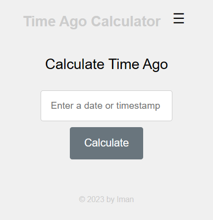
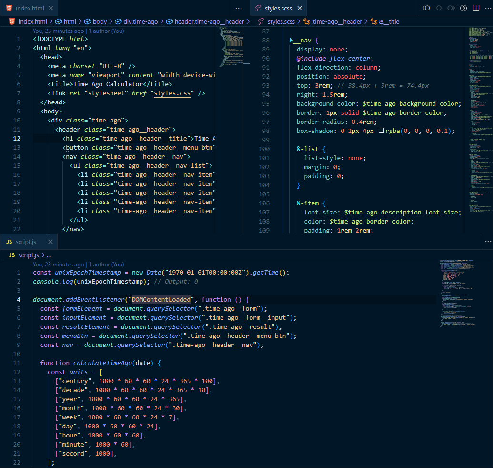

# Time Ago App

## Description

Time Ago App is a simple web application that allows you to enter a date or a timestamp and see the time elapsed since that moment. It displays the time difference in a user-friendly format, such as "2 days ago," "1 month ago," "1 year ago," etc.

The app accepts various date formats, including human-readable dates like "July 24, 2023," as well as Unix timestamps in milliseconds. It automatically detects the input format and provides real-time results without the need to refresh the page.

## Features

- Accepts both date formats and Unix timestamps (in milliseconds).
- Displays the time elapsed in a user-friendly format (e.g., "2 days ago," "1 month ago," "1 year ago").
- Real-time updating without page refresh.
- Responsive design for mobile, tablet, and desktop devices.
- Accessible for all users.

## How to Use

1. Enter a date or a timestamp in the input field.
2. Press the "Calculate" button or press Enter to see the time elapsed.

## Technologies Used

- HTML
- CSS (SCSS)
- JavaScript

## Preview

## Installation

1. Clone the repository: `git clone https://github.com/imanhedeshy/time-ago-app.git`
2. Open `index.html` in your web browser.

## Author

Iman Hedeshy - [GitHub](https://github.com/imanehdeshy)

## License

This project is licensed under the MIT License - see the [LICENSE](./LICENSE.md) file for details.

